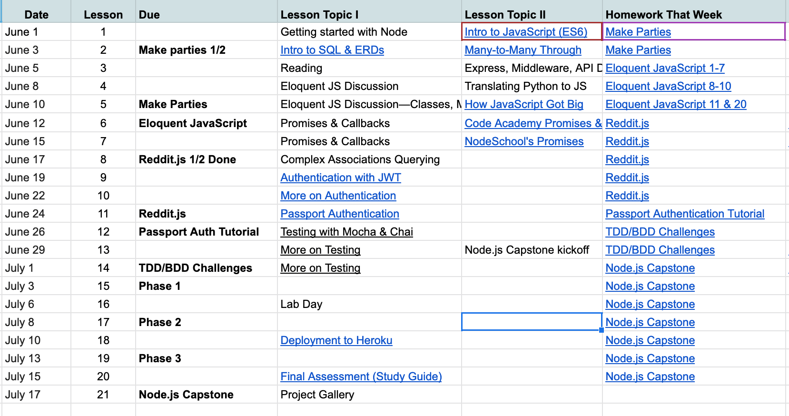

  

# BEW1.3 - Server-Side Architectures & Frameworks

| Instructor | Slack Channel | Course Website |
| :--------------------------------------: | :-----------: | :--------------------------------------: |
| [Braus](https://github.com/ajbraus) | _#bew1-3-node_ | [make.sc/bew1.3-t5](make.sc/bew1.3-t5) |

## Course Description

In this course, students build on knowledge of Resourceful and RESTful patterns and dive deep into the Node and Express ecosystems. Students learn how to manage greater scope and complexity in their code while consistently keeping the user's experience in mind through implementing a clone of the popular website, Reddit. The course will also cover the procedures required to authenticate and authorize web application users.

## Prerequisites

1. [BEW 1.2](http://make.sc/bew1-2)

## Learning Outcomes

Students by the end of the course will be able to ...

1. Diagram and implement resource associations using a document-based database.
1. Write advanced db queries with a focus on optimum performance and efficiency.
1. Discern between differing levels of persistence and the use cases that best fit each.
1. Implement authentication using JWT tokens and sessions.
1. Invent, create, test, deploy, and deliver a custom, fully secured API.

## Study Guide

To best prepare for the final exam, review [this study guide](study-guide.md).

## Class Schedule

**Course Dates:** Tuesday, March 31 – Thursday, May 14, 2020 (7 weeks)

**Class Times:** Tuesday and Thursday at 9:30 PM-12:15 PM (14 class sessions)

~~Assignments are due at 9:30 AM on the date listed, unless otherwise specified.~~

As of 4/14/2020, all assignments are due at 11:59 PM on the date listed.

  

<!-- 
| Class |     Date      | Topics | Assignment Due | Assessment |
| :---: | :-----------: | :--------: | :--------: | :--------: |
|   1   |  Tue, Mar 31  | [Intro to Node](Lessons/01-Intro-to-Node/) | - | |
|   2   |  Thu, Apr 2  | [JS Intro & Asynchronous Programming](Lessons/02-Intro-to-JS/) | [GIF Search Tutorial] | |
|   3   |  Tue, Apr 7  | [HTTP Methods & Endpoint Design](Lessons/03-Http-Methods/) | [Codecademy JS]: Promises & Async/Await [Promise Challenges] | |
|   4   |  Thu, Apr 9  | [Databases](Lessons/04-Databases/) | [Reddit.js] Part 1-3 | |
|   5   |  Tue, Apr 14   | [Testing with Mocha & Chai](Lessons/05-Testing-Mocha-Chai/) | [Reddit.js] Part 4-6 | |
|   6   |  Thu, Apr 16   | [Documentation with Docsify](Lessons/08-Documentation/) | [TDD/BDD Challenges] | |
|   7   |  Tue, Apr 21  | [Testing Express Routes](Lessons/06-Testing-Express-Routes/) | [API Project Proposal/Documentation] | [Midterm Assessment](Assessments/midterm-assessment.md) |
|   8   |  Thu, Apr 23  | [Review/Lab Day](Lessons/09-Review/) | [Chai Testing Challenges] |  |
|   9   |  Tue, Apr 28  | [Authentication with JWT](Lessons/07-Authentication/) | [Reddit.js] Part 7-9 | |
|  10   |  Thu, Apr 30  | [More Authentication](Lessons/11-More-Authentication/) | [API Project] Phase 2 | |
|  11   |  Tue, May 5  | Lab Day | [Reddit.js] Part 10-11 [Auth API Tutorial](https://scotch.io/tutorials/authenticate-a-node-es6-api-with-json-web-tokens) | |
|  12   |  Thu, May 7  | [Authentication with Passport](Lessons/10-Passport/) |  | |
|  13   |  Tue, May 12   | [Deployment](Lessons/12-Deployment/) | | |
|  14   |  Thu, May 14   | Final Class | [API Project] Phase 3 | [Final Assessment](Assessments/final-assessment.md) |

[GIF Search Tutorial]: https://www.makeschool.com/academy/track/gif-search-app-ynu
[Codecademy JS]: https://www.codecademy.com/learn/introduction-to-javascript
[Promise Challenges]: https://github.com/Make-School-Labs/promises-challenges
[Reddit.js]: https://www.makeschool.com/academy/track/reddit-clone-in-node-js
[TDD/BDD Challenges]: https://github.com/make-school-labs/tdd-bdd-challenge
[Chai Testing Challenges]: https://github.com/make-school-labs/chai-testing-challenges
[JWT/Authentication Challenges]: #
[Advanced Testing Challenges]: #
[Advanced Authentication Challenges]: #
[API Project Proposal/Documentation]: https://make-school-courses.github.io/BEW-1.3-Server-Side-Architectures-and-Frameworks/#/Lessons/08-Documentation/?id=wrap-up
[API Project]: Projects/02-Custom-API-Project.md

[Midterm Assessment]: Assessments/quiz-1.md
[Final Assessment]: Assessments/quiz-2.md

-->

1. [Make Parties (Tutorial)](https://www.makeschool.com/academy/track/make-tweets)
2. [Eloquent JavaScript (Textbook)](https://eloquentjavascript.net/)
3. [Reddit.js (Tutorial)](https://www.makeschool.com/academy/track/reddit-clone-in-node-js)
4. [Passport Authentication Challenge](https://docs.google.com/spreadsheets/d/1cItyOCe6tNv4EURFjmlOb6DdUvhV2WI7zCdoBhUyDHA/edit#gid=876739297)
5. [TDD/BDD Challenges](https://github.com/make-school-labs/tdd-bdd-challenge)
6. [Capstone Project](https://docs.google.com/a/makeschool.com/document/d/1HVG0vkrENPRUTzHSuaI41A0sp_MUIlwYG07Q77KImCA/edit?usp=sharing)

## Evaluation

**To pass this course, you must earn at least a 70% weighted average, according to the following breakdown**:

- Capstone Project: 30%
- Tutorials, Assignments, Projects, & Class Participation: 50%
- Quizzes/Assessments: 20%

In order to pass this course, you must also:

- Actively participate in class and abide by the attendance policy
- Make up all classwork from all absences

## Late Assignment Policy

- Late assignments that are submitted **no later that 2 days (48 hours)** after the deadline will be given a **10% late penalty**.
- Late assignments that are submitted **between 2 and 4 days (48-96 hours)** after the deadline will be given a **20% late penalty**.
- Late assignments that are submitted **more than 4 days (96 hours)** after the deadline will be given a **30% late penalty**.
- The **absolute last day** to submit any assignment will be **Friday, May 15 at 11:59 PM**.

If you require accommodations or have extenuating circumstances such as prolonged illness, please contact your instructor to request an extension.

## Additional Resources

* [jwt.io](https://jwt.io)
  * JSON Web Tokens are an open, industry standard RFC 7519 method for representing claims securely between two parties. JWT.IO allows you to **decode, verify and generate JWT**.
* See the **Additional Resources** section at the bottom of each day's lesson plan for the most up-to-date, helpful resources for that class period!

## Make School Course Policies

- [Program Learning Outcomes](https://make.sc/program-learning-outcomes) - What you will achieve after finishing Make School, all courses are designed around these outcomes.
- [Grading System](https://make.sc/grading-system) - How grading is done at Make School
- [Diversity and Inclusion Statement](https://make.sc/diversity-and-inclusion-statement) - Learn about Diversity and Inclusion at Make School
- [Academic Honesty](https://make.sc/academic-honesty-policy) - Our policies around plagerism, cheating, and other forms of academic misconduct 
- [Attendance Policy](https://make.sc/attendance-policy) - What we expect from you in terms of attendance for all classes at Make School
- [Course Credit Policy](https://make.sc/course-credit-policy) - Our policy for how you obtain credit for your courses
- [Disability Services (Academic Accommodations)](https://make.sc/disability-services) - Services and accommodations we provide for students
- [Student Handbook](https://make.sc/student-handbook) - Guidelines, policies, and resources for all Make School students
